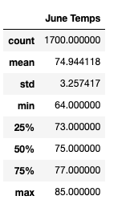
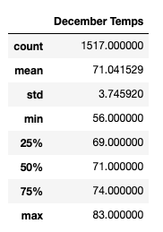

# surfs_up

## Overview

The purpose of reviewing the temperature throughout June and December is to make an educated estimation W. Avy's surf shop. He is concerned about business doing well, especially if the surf shop and ice cream shop have pontential to be succesful year round. Therefore, we selected two contrasting months to analyze how contrasting or similar their temperatures will most likely be.

## Results

* There is nearly 4 degree difference in the mean temperature amongst June and December
* However, there is an 8 degree difference in the minimum temperature between the two months
* About a .5 difference exists in the standard deviation 
* Overall, a drastic difference in temperature does not exist and its favorable for W. Avy's needs

## Summary

The data that we have collected is helpful in giving us an idea of what the weather will relatively be like during the two opposing seasons. However, it does not give us enough information to make sound choice if the W. Avy's businesses will be succesful year round, more queries will need to be conducted to make a stronger decision. 

An additional query that could be insightful is comparing levels of precipitation in June and December. We want to know how strong the humidity will be during the summer and winter, how often would it be possibly rain and for how long, how would these factors affect customers' willingness to go out. Other important queries that could be made are local wind speed stats, the likelihood of sunny days, and narrow in the analysis by evaluating the temperature locally.
